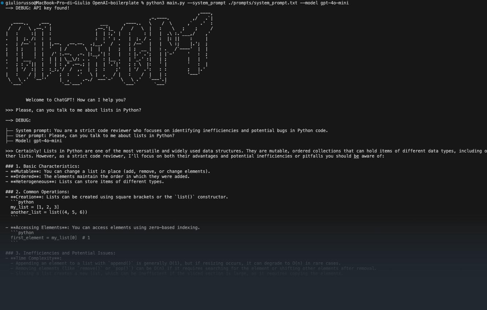

# 🟢 OpenAI Boilerplate Project

Boilerplate for working with the OpenAI API.
<br>

## Structure

```
OpenAI-boilerplate/
├── prompts/                        # Folder containing prompt text files
│   ├── init_terminal.txt           # Welcome print content
│   ├── system_prompt.txt           # System prompt content
├── utility/                        # Utility scripts
│   ├── build_messages.py           # Builds messages for the OpenAI API
│   ├── call_GPT.py                 # Handles API calls to OpenAI
│   ├── check_key.py                # Validates the API key
│   ├── debug_print.py              # Prints debug information
│   ├── display_init_terminal.py    # Initialize the welcome message inside the terminal
│   ├── load_key.py                 # Loads the API key from .env
│   ├── print_responde.py           # Print the GPT reponse with a typewriter effect
│   ├── read_prompt.py              # Reads content from the prompt text file
├── .env                            # Environment file (API key)
├── .gitignore                      # Git ignore file
├── main.py                         # Main script to run the project
├── README.md                       # Project documentation
├── requirements.txt                # List of dependencies
```

## Prerequisites
1. Python 3.8+
2. Install dependencies:
   ```bash
   pip install -r requirements.txt
   ```

## Setting Up the Project

### Step 1: Create the `.env` File
The `.env` file is used to store your OpenAI API key. You can create it inside the project folder via the command line:

```bash
echo "OPENAI_API_KEY=sk-your-api-key-here" > .env
```
Replace `sk-your-api-key-here` with your actual OpenAI API key.

### Step 2: Fill the `prompts/` Directory
Ensure that the `prompts/` folder contains the following file:
- `system_prompt.txt`: A text file with the system prompt.

You can store differen system prompt files in this folder and suit them to your use case.

### Step 3: Run the Main Script
Run the `main.py` script with custom file paths and model names as parameters:

```bash
python3 main.py
--system_prompt ./prompts/system_prompt.txt
--model gpt-4o-mini
```

or

```bash
python3 main.py
--sp ./prompts/system_prompt.txt
--m gpt-4o-mini
```


## Troubleshooting
- **No API Key Found**: Ensure your `.env` file is correctly set up with the `OPENAI_API_KEY` variable.
- **File Not Found Errors**: Verify that the paths to a system prompt (e.g., `system_prompt.txt`) is correct.
- **Dependency Issues**: Run `pip install -r requirements.txt` to install all required dependencies.

Your problem is not mentioned? Feel free to ask about it to me or by submitting an issue.

## License
This project is open-source and available under the MIT License.

